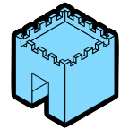

# this is a work in progress and not ready for installation :)

## SVG export from SketchUp

This is a SketchUp extension that exports 2D vector output.
 

## What it Does

It attempts to reproduce SketchUp model hierarchy and visual style in SVG.

## What it Doesn't Do

It does not reproduce the functionality of SketchUp Pro's `export PDF` feature.
Nothing is clipped. Overlapping objects are rendered in their entirety.
Very little effort is made to sort the stacking order of objects.
Therefore, unless the 3D model is carefully crafted to work with this extension, there is almost no chance
the output would match SketchUp's builtin 2D output of any kind.

## Why Make This?

Vector output from 3D programs can be difficult to work with in vector drawing apps.
This extension won't make it easy, but it will make it difficult in a different, useful way.
Namely, it will allow manipulation of the vector output based on the grouping of the model.

## Contributing / Developing

**TLDR;** you don't have to adhere to any of my nonsense to contribute, you can even make your
changes on the code in `dist/` and I'll propagate the changes into `src/` if I accept your pull request.

I'm not claiming this is a _good_ way to do things. It has, however, been productive for me, and by productive I mean I have outsourced a tremendous amount of work to my editor. The error checking and code completion is sufficient to keep me from getting stuck.

There are more than a few idiosyncracies to explain / apologise for in this codebase.
I've broken them down by language and tried to provide some rationale.

### Ruby

If you look at the `Rakefile` you will see some build steps that 'unsorbet' the ruby output.
These are removing the [sigils](https://sorbet.org/docs/static#fnref1), and removing the [type signatures](https://sorbet.org/docs/sigs)

### JavaScript

I'm new to javascript and desparately wanted code completion that would draw from the two libraries I am using. I achieved this for the most part but it came at a price. The js part of the build is a bit of a farce. The bundle created by webpack doesn't contain anything from ['sketchup-bridge'](https://github.com/Aerilius/sketchup-bridge), I manually comment out the import statement before bundling, and the actuall `bridge.js` file linked in the `index.html` for the main dialog is the one distributed by Aerilius. Again, I am only going through this rigamarole to get code completion, which is not readily available if all one's editor can see is an optimised minified js file.
